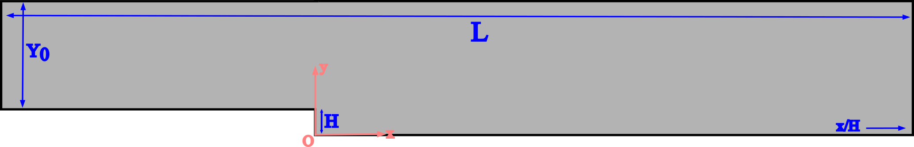
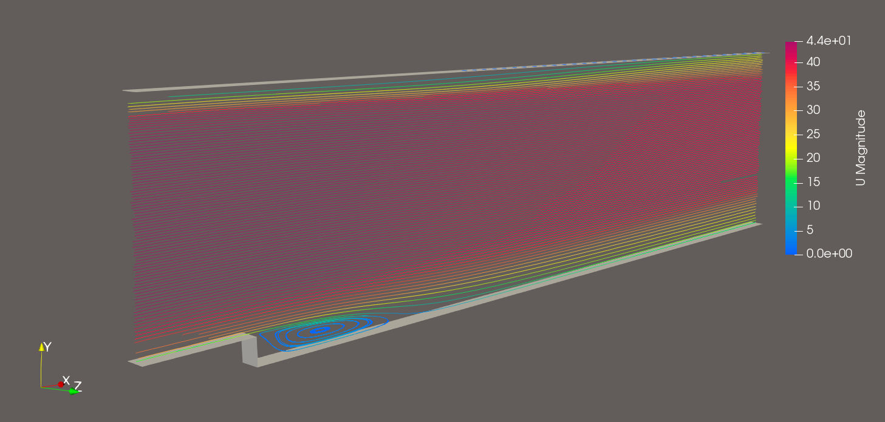

# Steady flow over a 2D backward facing step

## This canonical case is based on the description by Driver and Seegmiller

    D.M. Driver and H.L. Seegmiller. Features of a reattaching turbulent shear
    layer in divergent channel flow. AIAA Journal, 23(2):163–171, 1985.

## Introduction

This study serves as a comparison between OpenFOAM's simpleFoam solver and experimental data as obtained from a study done on the backward facing step with 0deg inclination. The workflow is fully automated, from mesh generation, to solver setup and post-processing. Further tests can be performed by changing mesh size, inlet velocity, duct length, wall inclination and other parameters, in order to study various setups.  

## Setup Details

Reynolds number based on the momentum thickness height is 5000 at 4 step heights upstream of the step.
Freestream velocity is 44.2 m/s at atmospheric pressure and temperature which corresponds to a Ma=0.128.

Stated reattachment length is at 6.26 +/- 0.1 x/h

## Case Runs

### Mesh manipulations

To change domain length, step height etc. modify vertices in the ***blockMeshDict*** file.
To calculate desired edge grading based on length, number of cells and first cell height, run the ***calc_grading.py*** script.
To alter number of cells on edges and input the calculated edge gradings, use the ***mesh_config.txt*** file.
Use the ***run_mesh.sh*** to update the mesh.

### Solver setup

3 different mesh sizings were tested, with a refinement factor of ~2 (12k, 28k and 56k elements). Measured quantity was the RMS L2 norm of velocity profile differences at different x/H locations. No significant changes were noticed after the medium mesh refinement, so it was kept as the benchmark of the study. Inlet boundary condition is the velocity profile as obtained from the experimental data. Outlet is atmospheric pressure and walls are set as no-slip.

The case runs using the ***execution.sh*** script.

### Results discussion

For further information please visit:

    https://www.openfoam.com/documentation/guides/latest/doc/verification-validation-turbulent-backward-facing-step.html
