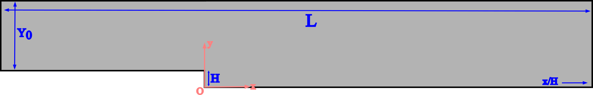
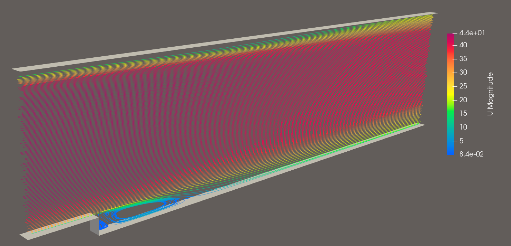
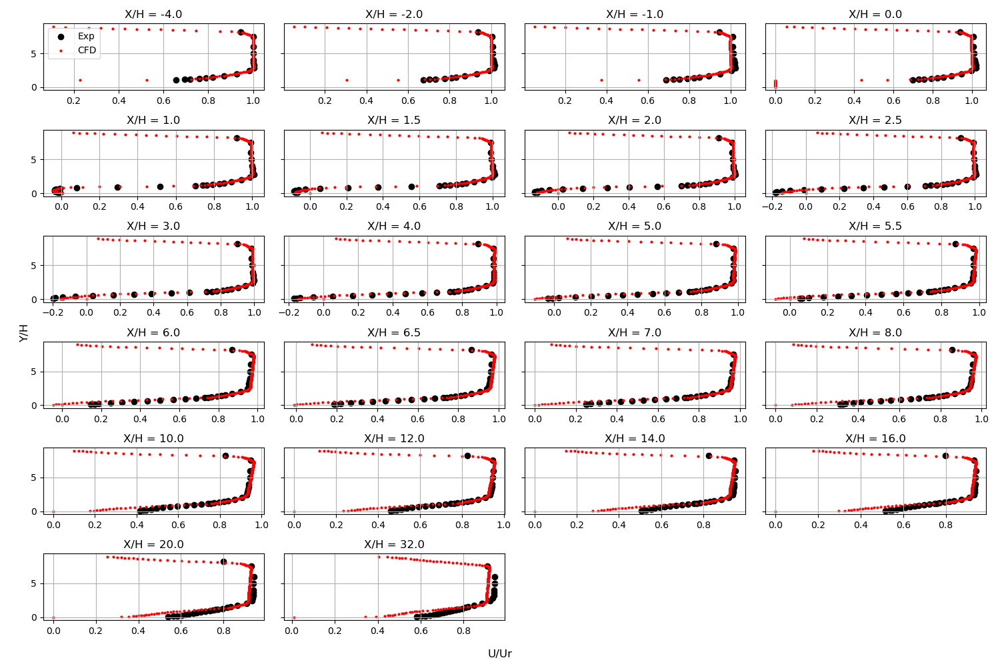
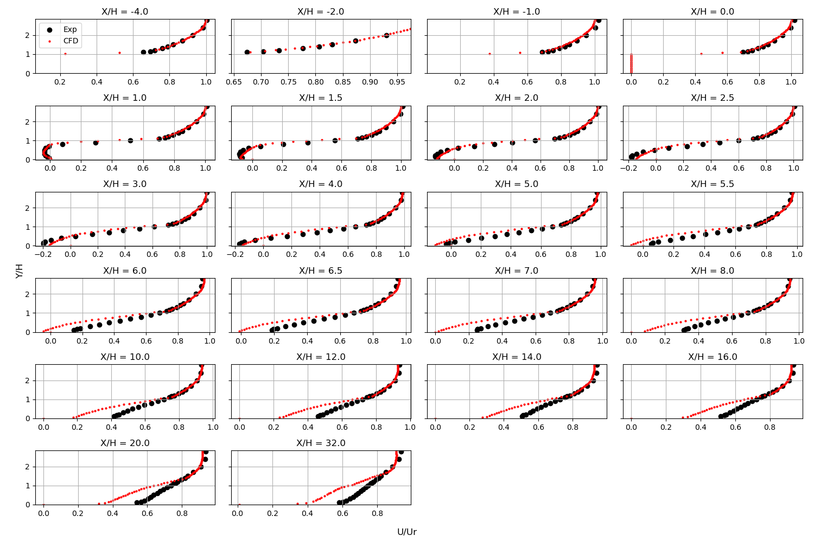
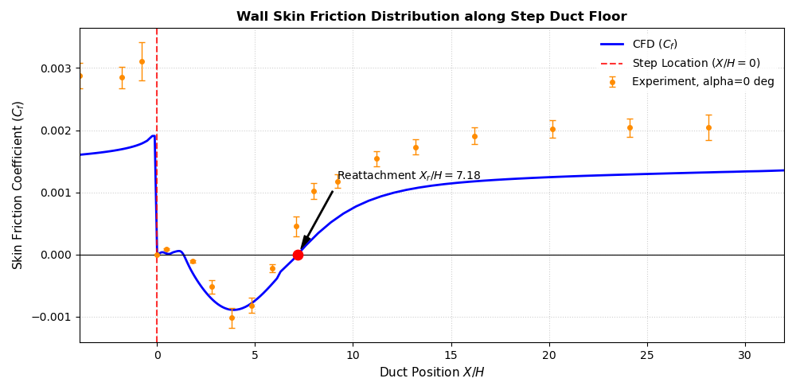

# Steady Flow Over a Two-Dimensional Backward-Facing Step

## Reference Case

This study is based on the experimental investigation reported by:

> D.M. Driver and H.L. Seegmiller, *Features of a Reattaching Turbulent Shear Layer in Divergent Channel Flow*, AIAA Journal, Vol. 23, No. 2, 1985, pp. 163–171.

---

## Introduction

The backward-facing step is a canonical benchmark case for the validation of turbulence models in separated flows. The sudden expansion induces flow separation, the formation of a recirculation region, and subsequent reattachment downstream of the step.

The objective of this project is to evaluate the performance of OpenFOAM's `simpleFoam` solver by comparing numerical predictions against the experimental measurements of Driver and Seegmiller. The workflow is fully automated, including mesh generation, case setup, execution, post-processing, and validation.

The repository is structured to facilitate further parametric studies involving variations in mesh resolution, inlet conditions, domain dimensions, and wall geometry.

---

## Objectives

* Validate OpenFOAM predictions against experimental data.
* Assess the ability of a RANS turbulence model to capture separation and reattachment.
* Quantify numerical accuracy through mesh independence studies.
* Compare velocity profiles and skin-friction distributions with published measurements.

---

## Flow Conditions

The Reynolds number based on momentum thickness is approximately 5000 at four step heights upstream of the expansion.

The freestream velocity is 44.2 m/s at atmospheric pressure and temperature, corresponding to a Mach number of 0.128. Compressibility effects are therefore expected to be negligible.

The experimentally measured reattachment length is:

**x/H = 6.26 ± 0.10**

### Computational Domain

---

## Numerical Setup

### Mesh Generation

The computational mesh is generated using `blockMesh`.

Domain dimensions, step geometry, and grading parameters can be modified directly through the `blockMeshDict` file.

To assist mesh generation:

* `calc_grading.py` computes grading factors from domain dimensions, cell counts, and first-cell heights.
* `mesh_config.txt` defines mesh resolution and grading parameters.
* `run_mesh.sh` regenerates the mesh automatically.

### Solver Configuration

The simulation is executed using OpenFOAM's steady-state incompressible solver `simpleFoam`.

Boundary conditions are defined as follows:

| Boundary | Condition                     |
| -------- | ----------------------------- |
| Inlet    | Experimental velocity profile |
| Outlet   | Atmospheric pressure          |
| Walls    | No-slip                       |

### Mesh Independence Study

Three structured meshes were evaluated:

| Mesh   | Number of Cells |
| ------ | --------------- |
| Coarse | ~12,000         |
| Medium | ~28,000         |
| Fine   | ~56,000         |

The mesh sensitivity study was performed using the RMS L2 norm of velocity profile differences at multiple streamwise locations.

Only minor differences were observed between the medium and fine meshes. Consequently, the medium mesh was selected for all subsequent analyses.

---

## Results

### Flow Topology

As expected, the sudden expansion generates an adverse pressure gradient that causes boundary-layer separation and the formation of a recirculation bubble downstream of the step.

---

### Velocity Profile Comparison

Predicted velocity profiles are compared against experimental measurements at multiple streamwise locations.

The numerical solution reproduces the overall flow behaviour with reasonable accuracy, including:

* The location of flow reattachment.
* The general shape of the recirculation region.
* The near-wall reverse-flow region downstream of the step.

---

### Near-Wall Behaviour

A closer inspection of the lower-wall region reveals noticeable discrepancies between numerical and experimental data.

The largest differences occur within the separated shear layer and near-wall recovery region.

These discrepancies are consistent with known limitations of eddy-viscosity RANS turbulence models in separated flows. The numerical solution exhibits a tendency toward excessive turbulent mixing, causing the shear layer to diffuse more rapidly and recover toward equilibrium earlier than observed experimentally.

---

### Skin-Friction Distribution

The influence of these modelling assumptions is further illustrated by the wall skin-friction coefficient distribution.

While the overall behaviour is captured successfully, differences in the predicted skin-friction recovery indicate that the numerical model does not fully reproduce the detailed dynamics of the separated shear layer.

---

## Discussion

The backward-facing step remains a challenging validation case due to the presence of:

* Flow separation and reattachment.
* Strong shear-layer development.
* Turbulence anisotropy.
* Large coherent flow structures.

Although the present simulation reproduces the principal flow features, some deviations from experimental measurements remain.

It should also be noted that the experimental configuration is inherently three-dimensional, with side-wall effects and spanwise flow structures influencing the measured data. In contrast, the numerical model is treated as a two-dimensional configuration, which may contribute to the observed differences in downstream recovery behaviour.

---

## Key Findings

* Good agreement was obtained for the overall velocity field and reattachment behaviour.
* The predicted reattachment location is close to the experimental value.
* Velocity profile discrepancies are primarily confined to the near-wall region and separated shear layer.
* The numerical solution exhibits faster downstream recovery than observed experimentally.
* Results are consistent with known limitations of RANS turbulence modelling for separated flows.

---

## References

Driver, D.M. and Seegmiller, H.L. (1985), *Features of a Reattaching Turbulent Shear Layer in Divergent Channel Flow*, AIAA Journal, 23(2), 163–171.

Additional information and validation data are available through the OpenFOAM verification and validation documentation:

https://www.openfoam.com/documentation/guides/latest/doc/verification-validation-turbulent-backward-facing-step.html
